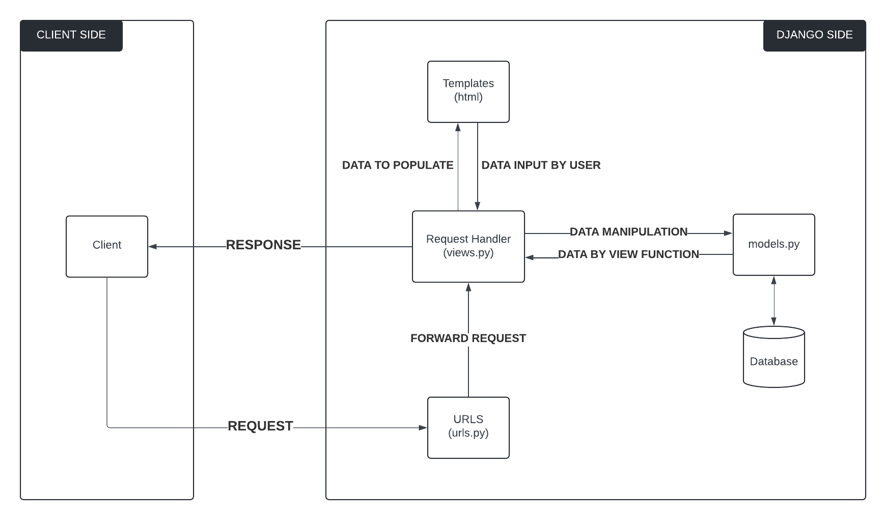

# Pasar Barang Pilihan

**WEBSITE**: <http://muhammad-fadhlan31-pasarbarangpilihan.pbp.cs.ui.ac.id/>

---

## Pertanyaan

### 1. Jelaskan bagaimana cara kamu mengimplementasikan checklist di atas secara step-by-step

1. Dimulai dari membuat proyek Django baru

    - Membuat folder baru untuk proyek ini dan mengaktifkan virtual environment agar proyek terisolasi dari sistem utama. Perintah yang dijalankan adalah:
    
            python -m venv venv

    - Setelah virtual environment dibuat, saya mengaktifkannya dengan:

            venv\Scripts\activate

    
    - Menyiapkan keperluan proyek baru: menambah .ignore, menginstall requirements.txt
    
    - Menjalankan command

            django-admin startproject pasar_barang_pilihan .

    - Menyiapkan .gitignore dan menginstall Django

            pip install django

    - Membuat proyek baru bernama pasar_barang_pilihan dengan menggunakan perintah berikut:

            django-admin startproject pasar_barang_pilihan .

2. Membuat Aplikasi Bernama main

    - Membuat aplikasi main yang akan menangani fungsi utama e-commerce dengan perintah:

            python manage.py startapp main

    - Menambahkan main ke dalam INSTALLED_APPS pada file settings.py:

            INSTALLED_APPS = [
                ...
                'main',
            ]

3. Membuat Model Product 

    - Membuat class Product di dalam file models.py yang memiliki tiga atribut yaitu name, price, dan description. Berikut kode model yang saya buat:

            from django.db import models

            class Product(models.Model):
                class Product(models.Model):
                    name = models.CharField(max_length=100)
                    price = models.IntegerField()
                    description = models.TextField()

    - Migrasi Database untuk membuat tabel Product

            python manage.py makemigrations
            python manage.py migrate
    
4. Membuat Template HTML
    - Membuat template main.html di dalam direktori templates di dalam folder main
    
            <h1>Pasar Barang Pilihan</h1>

            <h5>Name: </h5>
            
{{ name }}

            <h5>Class: </h5>
            
{{ class }}

5. Membuat Fungsi View

    - Menambahkan fungsi show_main di dalam views.py, Fungsi ini mengembalikan template main.html ketika URL root diakses. Berikut kodenya:

            from django.shortcuts import render

            def show_main(request):
                context = {
                    'name': 'Muhammad Fadhlan Karimuddin',
                    'class': 'PBP F'
                }
            return render(request, "main.html", context)

6. Routing URL untuk Aplikasi main

    - Membuat file urls.py di dalam folder main untuk mengatur routing URL di dalam aplikasi main:

            from django.urls import path
            from main.views import show_main

            app_name = 'main'

            urlpatterns = [
                path('', show_main, name='main')
            ]

    - Menghubungkan urls.py aplikasi ke proyek
    - Mengedit file urls.py di dalam proyek utama untuk menghubungkan routing dari aplikasi main:

            from django.contrib import admin
            from django.urls import path, include

            urlpatterns = [
                path('admin/', admin.site.urls),
                path('', include('main.urls')),
            ]

7. Deployment ke PWS

    - Deployment ke PWS dengan push ke REPO PWS

### 2. Buatlah bagan yang berisi request client ke web aplikasi berbasis Django beserta responnya dan jelaskan pada bagan tersebut kaitan antara urls.py, views.py, models.py, dan berkas html.

1. **Client Request**: Klien mengirimkan request (misalnya, HTTP GET atau POST) ke aplikasi Django.

1. **Client Request**: Klien mengirimkan request (misalnya, HTTP GET atau POST) ke aplikasi Django.

2. **urls.py**: Django memeriksa file urls.py untuk mencocokkan URL request klien dengan pola yang telah didefinisikan. Jika cocok, URL tersebut akan diteruskan ke view yang sesuai.
2. **urls.py**: Django memeriksa file urls.py untuk mencocokkan URL request klien dengan pola yang telah didefinisikan. Jika cocok, URL tersebut akan diteruskan ke view yang sesuai.

3. **views.py**: Di sini, views.py bertanggung jawab untuk memproses request dan menentukan data apa yang perlu dikirimkan ke template atau model. Jika perlu mengakses data dari database, view akan memanggil model.
3. **views.py**: Di sini, views.py bertanggung jawab untuk memproses request dan menentukan data apa yang perlu dikirimkan ke template atau model. Jika perlu mengakses data dari database, view akan memanggil model.

4. **models.py**: Jika view memerlukan data dari database, ia akan berinteraksi dengan models.py. Django ORM digunakan untuk mengambil, menyimpan, atau memperbarui data di database.
4. **models.py**: Jika view memerlukan data dari database, ia akan berinteraksi dengan models.py. Django ORM digunakan untuk mengambil, menyimpan, atau memperbarui data di database.

5. **HTML Template**: Setelah data dikumpulkan dari model, view mengirimkan data tersebut ke HTML template untuk dirender menjadi halaman web yang akan dikembalikan ke klien.
5. **HTML Template**: Setelah data dikumpulkan dari model, view mengirimkan data tersebut ke HTML template untuk dirender menjadi halaman web yang akan dikembalikan ke klien.

6. **Client Response**: Django merespon request klien dengan mengirimkan kembali halaman HTML yang sudah dirender.

6. **Client Response**: Django merespon request klien dengan mengirimkan kembali halaman HTML yang sudah dirender.

### 3. Jelaskan fungsi git dalam pengembangan perangkat lunak!

Git adalah sistem kontrol versi yang berfungsi untuk melacak perubahan kode dalam pengembangan perangkat lunak. Git memudahkan pengembang mengelola versi kode, memungkinkan kolaborasi tim melalui fitur branching dan merging, serta menyimpan riwayat perubahan secara terstruktur. Selain itu, Git membantu dalam revert atau mengembalikan perubahan jika terjadi kesalahan, menjaga integritas proyek. GitHub melengkapi Git sebagai platform kolaborasi berbasis web, memungkinkan tim untuk bekerja sama, berbagi kode, dan menjaga backup proyek secara aman. Kombinasi Git dan GitHub membuat pengembangan perangkat lunak lebih terstruktur, aman, dan efisien.

### 4. Menurut Anda, dari semua framework yang ada, mengapa framework Django dijadikan permulaan pembelajaran pengembangan perangkat lunak?

Django dijadikan permulaan dalam pembelajaran pengembangan perangkat lunak karena memiliki struktur Model-View-Template (MVT) yang jelas, fitur-fitur bawaan yang lengkap (batteries included), dan dokumentasi yang sangat baik, sehingga memudahkan pemula untuk memahami konsep dasar pengembangan web. Selain itu, Django memiliki komunitas yang kuat dan fitur keamanan yang terintegrasi, sehingga pengembang baru bisa belajar secara mandiri dengan dukungan komunitas serta memahami pentingnya keamanan dalam pengembangan aplikasi sejak awal.

### 5. Mengapa model pada Django disebut sebagai ORM?

Model pada Django disebut sebagai ORM (Object-Relational Mapping) karena Django menggunakan pendekatan ini untuk memetakan objek dalam kode Python ke tabel dalam basis data relasional. ORM memungkinkan pengembang untuk bekerja dengan data dalam bentuk objek Python.

Dengan Django ORM, setiap class di dalam model mewakili tabel dalam basis data, dan setiap atribut dari class tersebut menjadi kolom pada tabel. Ini memungkinkan pengembang untuk berinteraksi dengan data (seperti membuat, membaca, memperbarui, atau menghapus) melalui metode Python tanpa harus menulis SQL secara langsung, sehingga mempermudah pengelolaan data dan meningkatkan produktivitas.