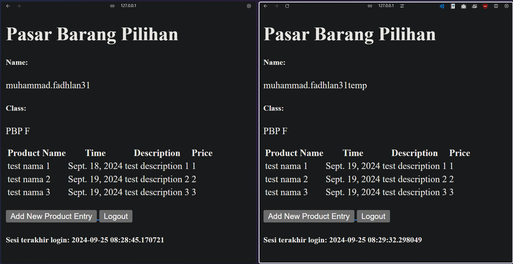

# Pasar Barang Pilihan

## TUGAS 4

**WEBSITE**: <http://muhammad-fadhlan31-pasarbarangpilihan.pbp.cs.ui.ac.id/>

---

# Pertanyaan

## 1. Apa itu Django UserCreationForm, dan jelaskan apa kelebihan dan kekurangannya?

**Django UserCreationForm** adalah form bawaan yang disediakan oleh Django untuk mempermudah pembuatan pengguna baru. Form ini mencakup beberapa field standar seperti `username`, `password1`, dan `password2`. `UserCreationForm` sudah menyediakan validasi dasar seperti memastikan bahwa password yang dimasukkan oleh pengguna cocok di kedua field password.

### Kelebihan:
1. **Kemudahan Penggunaan**: Tidak perlu menulis kode dari nol untuk membuat form registrasi pengguna. Django sudah menyediakan form ini yang langsung bisa digunakan tanpa banyak modifikasi.
2. **Validasi Otomatis**: Form ini secara otomatis memvalidasi password, memastikan bahwa pengguna mengisi kedua field password dengan benar dan konsisten.
3. **Integrasi dengan Model User**: Karena terintegrasi langsung dengan model `User`, kita tidak perlu khawatir tentang bagaimana menyimpan informasi pengguna ke dalam basis data. Django mengurusnya secara otomatis.
4. **Keamanan yang Terjamin**: `UserCreationForm` menggunakan sistem enkripsi yang aman untuk password dan tidak menyimpan password dalam bentuk teks biasa (plaintext).

### Kekurangan:
1. **Terbatas pada Field Standar**: `UserCreationForm` hanya menyediakan field standar seperti username dan password. Jika kita ingin menambahkan field lain (misalnya email, first_name, last_name), kita harus mengkustomisasi form ini dengan cara menambahkan field secara manual.
2. **Validasi yang Kurang Fleksibel**: Jika kita membutuhkan validasi yang lebih kompleks, seperti validasi berdasarkan pola tertentu atau syarat khusus untuk password, kita perlu mengoverride metode yang ada atau membuat form baru.
3. **Kurang Cocok untuk Kustomisasi Lebih Lanjut**: Form ini mungkin tidak mencukupi untuk aplikasi yang memerlukan proses pendaftaran yang lebih spesifik atau melibatkan banyak informasi pengguna.

Dalam proyek Django, form ini banyak digunakan karena praktis dan cocok untuk aplikasi yang memerlukan proses pendaftaran pengguna sederhana.

## 2. Apa perbedaan antara autentikasi dan otorisasi dalam konteks Django, dan mengapa keduanya penting?

**Autentikasi** dan **otorisasi** adalah dua konsep yang berbeda namun saling melengkapi dalam konteks keamanan aplikasi web. Keduanya sangat penting dalam pengelolaan akses pengguna ke aplikasi.

- **Autentikasi**: Autentikasi adalah proses memverifikasi identitas pengguna. Ini adalah langkah di mana sistem memastikan bahwa pengguna yang berusaha masuk ke aplikasi adalah pengguna yang sah. Proses ini biasanya melibatkan verifikasi kredensial seperti username dan password. Di Django, autentikasi dilakukan menggunakan fungsi seperti `authenticate()` dan `login()` yang tersedia dari modul `django.contrib.auth`.

- **Otorisasi**: Otorisasi, di sisi lain, adalah proses memverifikasi apakah pengguna yang telah diautentikasi memiliki izin untuk mengakses sumber daya tertentu atau melakukan tindakan tertentu di dalam aplikasi. Django menyediakan decorators seperti `@login_required` untuk memastikan bahwa pengguna hanya dapat mengakses halaman tertentu setelah diautentikasi, dan permission classes untuk mengatur otorisasi.

### Mengapa Keduanya Penting?
- **Autentikasi** penting untuk memastikan bahwa hanya pengguna yang memiliki kredensial yang benar yang dapat mengakses aplikasi, sehingga mengurangi risiko akses tidak sah.
- **Otorisasi** sangat penting untuk melindungi data sensitif dan mencegah pengguna melakukan tindakan yang tidak diizinkan. Contohnya, pengguna biasa mungkin tidak diizinkan untuk mengakses halaman admin atau melakukan perubahan pada data pengguna lain.

Penting untuk membedakan antara keduanya karena autentikasi saja tidak cukup. Setelah pengguna diidentifikasi, sistem juga perlu memastikan bahwa mereka hanya dapat mengakses atau mengubah data yang sesuai dengan hak akses mereka.

## 3. Apa itu cookies dalam konteks aplikasi web, dan bagaimana Django menggunakan cookies untuk mengelola data sesi pengguna?

**Cookies** adalah file kecil yang disimpan di browser pengguna dan berisi informasi tentang sesi pengguna. Cookies memungkinkan server web untuk mengenali pengguna pada setiap permintaan berikutnya, sehingga pengguna dapat melanjutkan sesi mereka tanpa harus login ulang setiap kali mereka membuka halaman baru di aplikasi.

### Penggunaan Cookies di Django:
Dalam Django, cookies sering digunakan untuk menyimpan **ID sesi pengguna**. Setelah pengguna berhasil login, Django membuat ID sesi yang unik dan mengirimkannya ke browser dalam bentuk cookie. Setiap kali pengguna mengirimkan permintaan ke server (misalnya mengunjungi halaman baru), cookie ini dikirim bersama permintaan sehingga server dapat mengenali pengguna dan melacak sesi mereka.

Django juga menyediakan cookies untuk fitur lain seperti menyimpan preferensi pengguna atau informasi sementara yang dibutuhkan selama sesi pengguna. Contohnya, dalam aplikasi ini, kita menggunakan cookie `last_login` untuk menyimpan waktu login terakhir pengguna.

## 4. Apakah penggunaan cookies aman secara default dalam pengembangan web, atau apakah ada risiko potensial yang harus diwaspadai?

Penggunaan cookies dalam pengembangan web **tidak sepenuhnya aman secara default**. Meskipun cookies sangat berguna, ada beberapa risiko yang perlu diperhatikan:

### Risiko Potensial:
1. **Cookie Hijacking (Pencurian Cookie)**: Cookies dapat dicuri jika dikirim melalui koneksi yang tidak aman (misalnya HTTP biasa tanpa SSL). Jika cookie sesi pengguna dicuri, penyerang dapat menyamar sebagai pengguna tersebut.
2. **Cross-Site Scripting (XSS)**: Serangan XSS memungkinkan penyerang menyuntikkan skrip berbahaya ke dalam aplikasi web yang kemudian akan dijalankan di browser pengguna. Melalui skrip ini, penyerang dapat mencuri cookies pengguna.
3. **Cookies Tidak Dienkripsi**: Jika cookies tidak dienkripsi, data sensitif seperti ID sesi atau preferensi pengguna dapat dengan mudah diakses oleh pihak ketiga.

### Keamanan Cookies di Django:
Django menyediakan beberapa cara untuk mengamankan cookies:
- **`SESSION_COOKIE_SECURE`**: Mengatur agar cookie sesi hanya dikirim melalui koneksi HTTPS, sehingga mencegah cookie dicuri melalui jaringan yang tidak aman.
- **`SESSION_COOKIE_HTTPONLY`**: Mengatur agar cookie tidak dapat diakses melalui JavaScript, yang membantu mencegah serangan XSS.

Dengan pengaturan yang tepat, penggunaan cookies dapat dijadikan aman, namun tetap perlu berhati-hati dengan risiko yang mungkin timbul.

## 5. Jelaskan bagaimana cara kamu mengimplementasikan checklist di atas secara step-by-step

### 1. Mengimplementasikan Fungsi Registrasi, Login, dan Logout:
   - **Registrasi**: Saya menggunakan `UserCreationForm` dari Django untuk menyediakan form pendaftaran bagi pengguna baru. Form ini sudah menyediakan validasi password secara otomatis.
   - **Login**: Saya menggunakan `AuthenticationForm` untuk mengautentikasi pengguna berdasarkan kredensial yang mereka masukkan. Jika valid, pengguna diizinkan login dan ID sesi disimpan dalam cookie. Selain itu, saya menambahkan cookie `last_login` untuk mencatat waktu login terakhir.
   - **Logout**: Menggunakan fungsi `logout()` dari Django untuk menghapus sesi pengguna dan menghapus cookie `last_login`.

### 2. Membuat Dua Akun Pengguna dan Dummy Data:
   - Saya membuat dua akun pengguna di database dan menggunakan admin panel Django untuk memasukkan tiga entri dummy data ke model `Product` untuk setiap akun.

### 3. Menghubungkan Model Product dengan User:
   - Dalam model `Product`, saya menambahkan field `ForeignKey` yang menghubungkan produk dengan pengguna yang membuatnya. Ini memastikan bahwa setiap produk terhubung dengan satu pengguna.

### 4. Menampilkan Informasi Pengguna yang Login dan Menerapkan Cookies:
   - Pada halaman utama (`main.html`), saya menampilkan nama pengguna yang sedang login menggunakan `request.user.username`. Saya juga menampilkan cookie `last_login` untuk menampilkan kapan terakhir kali pengguna login.

### 5. Menyimpan Perubahan di GitHub:
   - Setelah selesai mengimplementasikan semua fitur, saya menggunakan perintah `git add`, `git commit`, dan `git push` untuk menyimpan dan mengunggah kode ke repositori GitHub.

---
Screenshot User & Data
