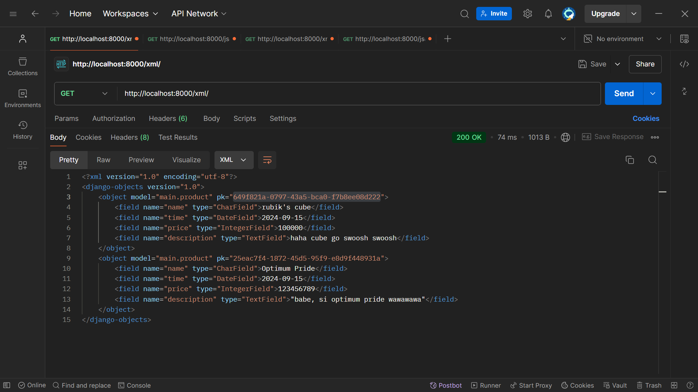
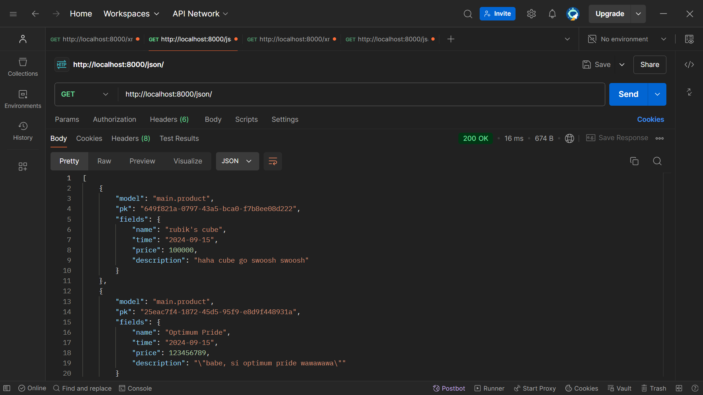
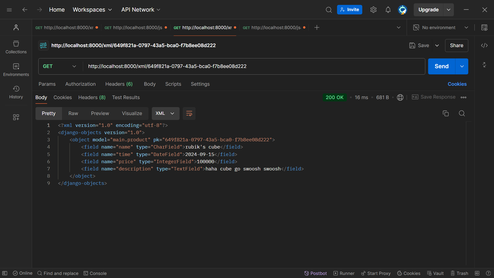
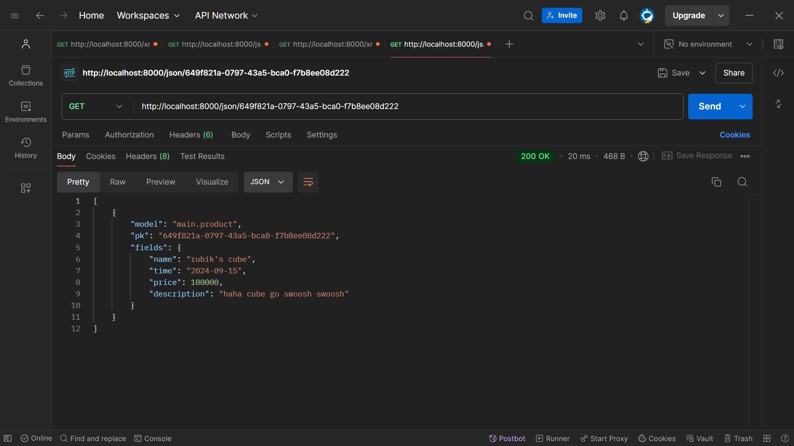

# Pasar Barang Pilihan

## TUGAS 3

**WEBSITE**: <http://muhammad-fadhlan31-pasarbarangpilihan.pbp.cs.ui.ac.id/>

---

## Pertanyaan

### 1. Jelaskan mengapa kita memerlukan data delivery dalam pengimplementasian sebuah platform?

Data delivery diperlukan untuk mengirimkan dan menerima data antara berbagai komponen atau lapisan dalam sebuah platform. Ini memungkinkan komunikasi antara frontend dan backend, pertukaran informasi antar sistem, serta interoperabilitas antara berbagai perangkat dan platform. Dengan data delivery, platform dapat berfungsi secara dinamis, mentransfer data dalam format yang terstruktur seperti JSON dan XML, sehingga memastikan aplikasi dapat dijalankan di berbagai lingkungan dengan lancar dan aman​.

### 2. Menurutmu, mana yang lebih baik antara XML dan JSON? Mengapa JSON lebih populer dibandingkan XML?

Secara umum, JSON lebih baik dibandingkan XML untuk pengiriman data dalam aplikasi modern, terutama aplikasi berbasis web. JSON lebih ringan, lebih mudah dibaca oleh manusia, dan memiliki sintaks yang lebih sederhana dibandingkan XML. JSON juga lebih terintegrasi dengan JavaScript, bahasa yang banyak digunakan di web development. Selain itu, parsing JSON lebih cepat dibandingkan XML, menjadikannya pilihan yang lebih efisien untuk komunikasi antar sistem.

### 3. Jelaskan fungsi dari method `is_valid()` pada form Django dan mengapa kita membutuhkan method tersebut?

Method `is_valid` pada form Django digunakan untuk memeriksa apakah data yang dimasukkan ke dalam form memenuhi validasi yang telah didefinisikan pada model atau form. Jika valid, method ini mengembalikan nilai `True`, yang berarti data tersebut sesuai dan bisa diproses lebih lanjut, seperti disimpan ke database. Sebaliknya, jika data tidak valid, method ini mengembalikan `False`, dan Django akan menyediakan pesan error untuk menunjukkan kesalahan yang perlu diperbaiki.

Pada kode, method `is_valid` digunakan pada fungsi `create_product_entry` untuk memvalidasi input form yang bertujuan menambahkan produk baru. Hanya jika data valid dan request adalah POST, produk baru akan disimpan ke database

```py
def create_product_entry(request):
    form = ProductEntryForm(request.POST or None)

    if form.is_valid() and request.method == "POST":
        form.save()
        return redirect('main:show_main')
```

Dibutuhkan `is_valid` untuk mencegah data yang tidak sesuai atau tidak lengkap masuk ke dalam database, menjaga konsistensi dan integritas data. Misalnya, jika pengguna tidak memasukkan harga produk, validasi akan gagal, dan form tidak akan diproses lebih lanjut sampai data yang benar diisi.

### 4. Mengapa kita membutuhkan `csrf_token` saat membuat form di Django? Apa yang dapat terjadi jika kita tidak menambahkan `csrf_token` pada form Django? Bagaimana hal tersebut dapat dimanfaatkan oleh penyerang?

`csrf_token` di Django berfungsi untuk melindungi aplikasi dari Cross-Site Request Forgery (CSRF), yaitu serangan di mana penyerang mencoba melakukan permintaan (request) yang tidak sah dari pengguna tanpa sepengetahuan mereka.

Dalam form fungsi create_product_entry, ditambahkan `csrf_token` untuk memastikan bahwa permintaan POST yang dilakukan untuk menambah produk hanya bisa terjadi dari halaman web yang sah, yaitu yang berhubungan dengan aplikasi Django. Ini mencegah serangan yang memanfaatkan pengguna yang sudah logged in untuk melakukan aksi seperti menambah data tanpa persetujuan pengguna.

Jika tidak menambahkan `csrf_token` pada form, penyerang bisa membuat halaman web berbahaya yang mengirimkan request ke aplikasi menggunakan pengguna yang logged in, memungkinkan mereka untuk memanipulasi data atau melakukan tindakan lain tanpa izin.

Pada file `create_product_entry.html', `csrf_token` digunakan sebagai berikut:

```html
...
<form method="POST">
  
  ...
</form>
...
```


### 5. Jelaskan bagaimana cara kamu mengimplementasikan checklist di atas secara step-by-step (bukan hanya sekadar mengikuti tutorial).

- ***Membuat Input Form untuk Menambahkan Produk:*** Saya mulai dengan membuat form di `forms.py` menggunakan `ModelForm` untuk menerima data produk baru. Form ini terdiri dari field `name`, `price`, dan `description` yang sudah didefinisikan di model `Product` di `models.py`.

- ***Menambah Views untuk Menampilkan Data dalam Format XML dan JSON:*** Setelah itu, saya membuat views di `views.py` untuk menampilkan data produk dalam format XML dan JSON. Menggunakan `serializers` dari Django, saya menampilkan semua data produk menggunakan fungsi `show_xml` dan `show_json`. Saya juga membuat views tambahan untuk menampilkan data berdasarkan ID, seperti `show_xml_by_id` dan `show_json_by_id`.

- ***Routing URL:*** Kemudian, saya menambahkan path URL di `urls.py` untuk setiap view yang saya buat, termasuk endpoint untuk menampilkan data produk dalam format XML dan JSON, baik secara keseluruhan maupun berdasarkan ID.

- ***Pengujian dengan Postman:*** Setelah semuanya selesai, saya melakukan pengujian untuk memastikan semua fungsi berjalan dengan baik, menggunakan Postman untuk mengakses URL yang menampilkan data produk dalam format XML dan JSON, baik semua data maupun berdasarkan ID.

### Screenshot Postman



